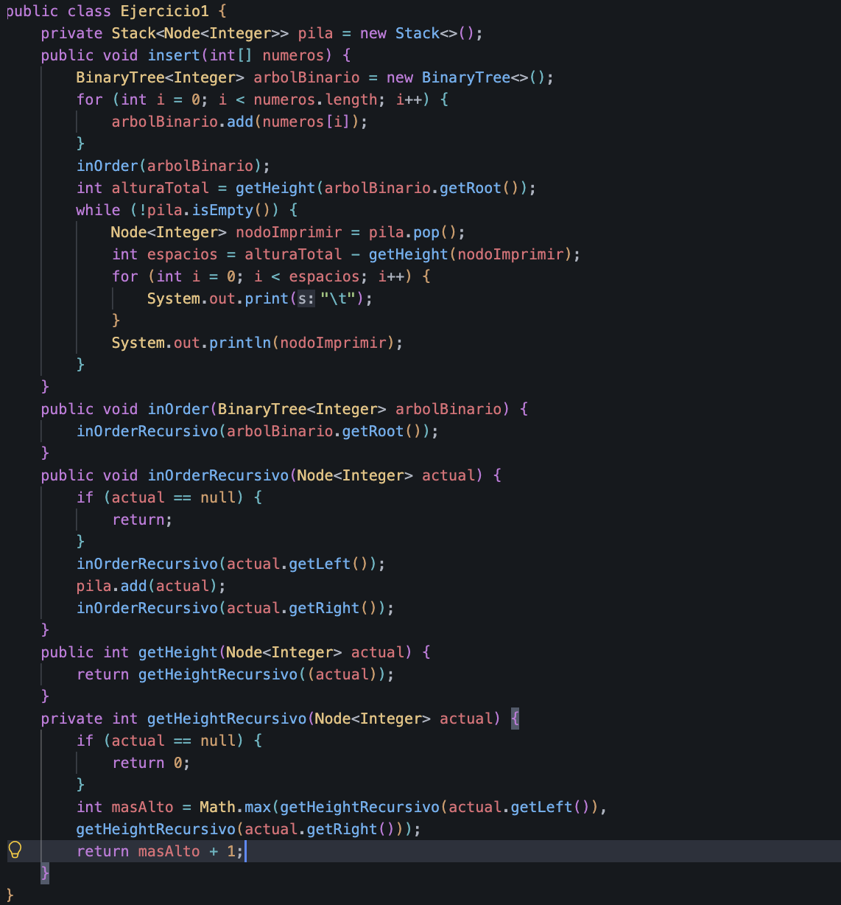
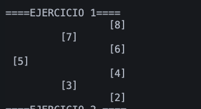
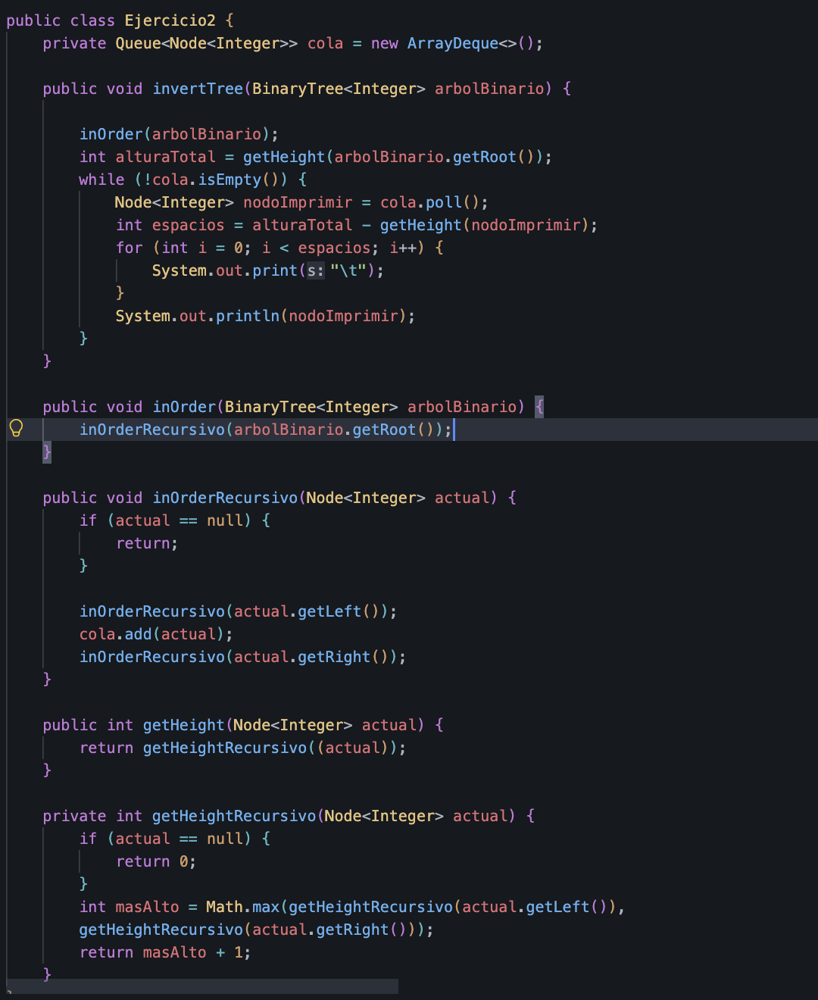
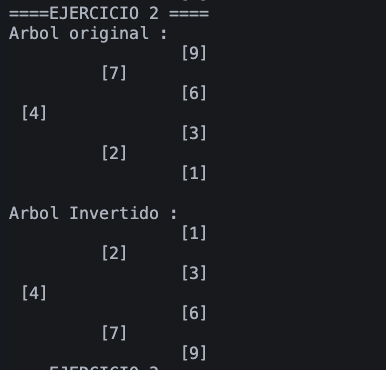
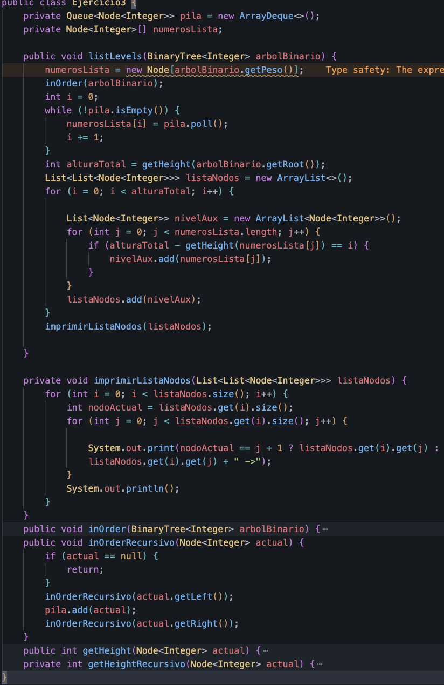
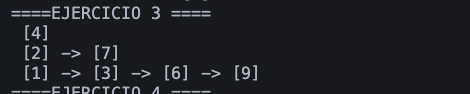
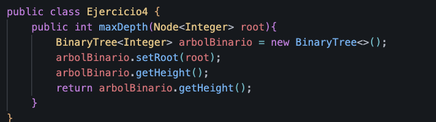
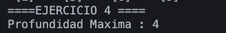

# INFORME TÉCNICO:
∫
# ÁRBOLES BINARIOS DE BÚSQUEDA 

## Datos de Evaluación

- **Estudiante:** Stephan Axel Cedillo Mendoza
- **Institución:** Universidad Politécnica Salesiana
- **Curso:** Estructura de Datos - Grupo 1
- **Fecha :** 23/06/2026

---

## Descripción General
Este documento presenta el desarrollo de varios algoritmos aplicados sobre Árboles Binarios de Búsqueda, utilizando el lenguaje de programación Java. El trabajo se centró en la implementación de operaciones como la inserción de nodos, la inversión de la estructura del árbol, la aplicacion de como resolver ejercicios mediante colas FIFO y el cálculo recursivo de la altura. 

---

## Ejercicio 01: Insertar en BST

### Especificación Algorítmica
El algoritmo recibe una secuencia desordenada de valores enteros en un arreglo unidimensional. Luego se recorre ese arreglo de forma secuencial y cada valor se inserta en un Árbol Binario de Búsqueda, donde se cumple la regla de que los valores menores van al subárbol izquierdo y los mayores o iguales van al subárbol derecho, formando así una estructura ordenada de manera ascendente.

Después, se implementa un recorrido en orden (inOrder) modificado, donde los nodos no se imprimen directamente, sino que se guardan en una estructura de tipo pila (java.util.Stack). Al vaciar la pila siguiendo el orden LIFO, los nodos se van mostrando en consola con una cantidad de espacios o tabulaciones que depende de la altura de cada nodo. Esto permite ubicar cada elemento en su nivel dentro del árbol y genera una representación visual del BST girada 90 grados, facilitando su comprensión desde la salida en texto.

### Código

### Evidencia de Consola

### Observaciones 
Se comprobó que el árbol se construye correctamente. Cada vez que se inserta un valor, se mantiene la regla del Árbol Binario de Búsqueda, donde los valores menores quedan a la izquierda y los mayores o iguales a la derecha.

También se realizó una verificación visual del árbol en la consola. Esto se logró mostrando los nodos con espacios que dependen de la altura de cada uno, lo que permite ver su posición dentro de la estructura. De esta forma, se puede entender cómo está formado el árbol y si está equilibrado sin necesidad de usar interfaces gráficas.

---

## Ejercicio 02: Invertir Árbol Binario

### Especificación Algorítmica

El objetivo del ejercicio es transformar el árbol binario original en su forma simétrica, es decir, un árbol invertido. El algoritmo implementado recorre el árbol de forma recursiva en post-orden. En cada nodo visitado se intercambian sus hijos: el hijo izquierdo pasa a ocupar la posición del hijo derecho y el hijo derecho pasa a la posición del hijo izquierdo.

Para comprobar que el cambio se realizó correctamente, el programa primero ejecuta un recorrido inOrder del árbol original y guarda los valores en una cola (java.util.Queue) para mostrarlos después en consola. Luego de aplicar la inversión del árbol, se repite el mismo proceso. Al comparar ambas salidas, se puede observar que el orden de los valores cambia, lo que confirma que la estructura del árbol fue invertida correctamente.

### Código

### Evidencia de Consola

### Observaciones 
La inversión del árbol cambia el orden del recorrido inOrder. Es decir, una secuencia que antes estaba ordenada de forma ascendente pasa a mostrarse en orden descendente después de la transformación.

Durante este proceso, los enlaces entre nodos se intercambian correctamente y no se pierden nodos hoja, ya que todos los elementos del árbol se conservan dentro de la misma estructura, solo cambia su posición dentro de ella.

---

## Ejercicio 03: Listar Niveles

### Especificación Algorítmica

La implementación realiza un recorrido del árbol binario de búsqueda utilizando primero un recorrido inOrder para obtener todos los nodos en un orden definido. Durante este proceso, cada nodo visitado se almacena en una estructura de tipo cola, lo que permite mantener el orden de procesamiento sin depender de la recursividad para el almacenamiento final.

Una vez completado el recorrido, los elementos de la cola se transfieren a un arreglo de nodos (numerosLista), el cual facilita el acceso indexado a cada elemento del árbol. A partir de esta estructura, se calcula la altura total del árbol utilizando un método recursivo que evalúa la profundidad máxima entre subárboles izquierdo y derecho.

Con la altura total conocida, se construye una representación por niveles del árbol. Para cada nivel, se recorren todos los nodos almacenados y se seleccionan aquellos cuya altura relativa coincide con el nivel actual. Estos nodos se agrupan en sublistas, formando una estructura de listas anidadas donde cada sublista representa un nivel del árbol.

Finalmente, la estructura generada se imprime en consola mostrando los nodos de cada nivel conectados mediante flechas, lo que permite visualizar claramente la distribución jerárquica del árbol desde la raíz hasta las hojas.

### Código

### Evidencia de Consola

### Observaciones 
La salida del programa muestra cómo se distribuyen los valores del árbol según su nivel de profundidad. Esto permite ver de forma clara cómo están organizados los nodos dentro de la estructura.

Además, este recorrido deja en evidencia si el árbol está equilibrado o si tiene más elementos de un lado que del otro, después de realizar las inserciones.

En cuanto al rendimiento, el proceso mantiene una complejidad temporal de O(N), ya que cada nodo es recorrido y procesado una sola vez.

---

## Ejercicio 04: Profundidad Máxima

### Especificación Algorítmica
Se realizó el cálculo de la profundidad máxima del árbol, entendida como la distancia desde la raíz hasta el nodo más profundo. Para ello se implementó el método público `maxDepth(Node root)`, encargado de devolver un valor entero que representa la altura total de la estructura.

En la implementación, se reutiliza la lógica ya existente dentro de la clase `BinaryTree`. Para esto, se crea una instancia temporal del árbol, se asigna el nodo raíz recibido y se invoca directamente el método `getHeight()`, que ya contiene el cálculo recursivo de la altura.

De esta forma, el resultado se obtiene sin duplicar lógica, ya que el método `getHeight` calcula la profundidad recorriendo el árbol de manera recursiva hasta las hojas. El valor final representa el camino más largo desde la raíz hasta un nodo terminal.

### Código

### Evidencia de Consola

### Observaciones 
Se comprobó que la profundidad máxima del árbol coincide exactamente con la altura calculada desde la raíz. Ambos valores representan la misma medida de forma estructural.

El método funciona correctamente en distintos casos, incluyendo árboles balanceados, árboles muy desordenados con forma de lista (degenerados) y también cuando el árbol está vacío.

---

## Repositorio del Proyecto
[Enlace del Proyecto](https://github.com/StephanCedillo/icc-est-u2-estructurasNoLineales)