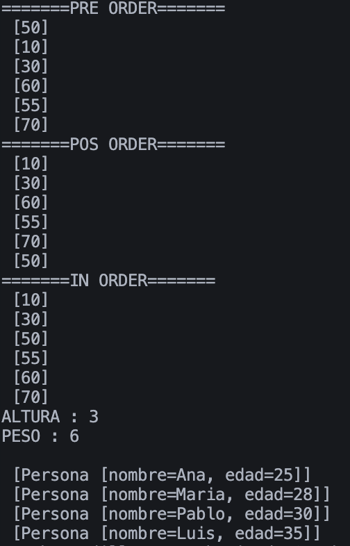
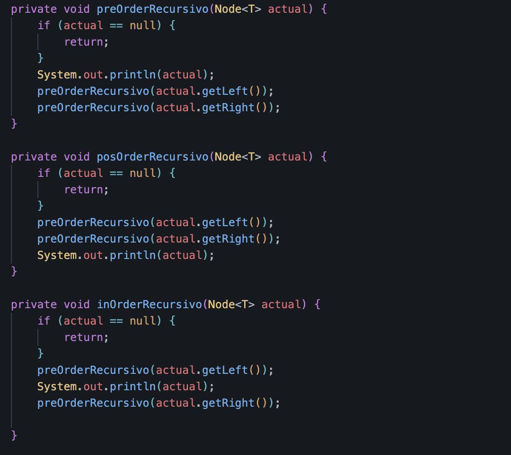

# Implementación de Árboles Binarios de Búsqueda en Java

## Datos del Estudiante

* **Nombre:** Stephan Axel Cedillo Mendoza
* **Curso:** Estructura de Datos - GRUPO 1
* **Fecha:** 23/06/2026

---

## Estructura del Proyecto

El proyecto está organizado en tres paquetes principales:

* **structures.node**

  * `Node<T>`: Representa un nodo del árbol y almacena el dato junto con las referencias a sus hijos izquierdo y derecho.

* **structures.trees**

  * `BinaryTree<T>`: Implementación genérica de un árbol binario de búsqueda para cualquier tipo que implemente `Comparable`.
  * `IntTree`: Implementación específica para valores de tipo `Integer`.

* **models**

  * `Persona`: Clase de ejemplo que implementa `Comparable<Persona>`, comparando primero por edad y luego por nombre.

---

## Funcionalidades

Ambas implementaciones de árboles incluyen las siguientes operaciones:

* **Inserción (`add`)**

  Para insertar elementos utilicé un método recursivo llamado `addRecursivo()`. Primero se verifica si el nodo actual es `null`; si lo es, se inserta el nuevo nodo y se incrementa el peso del árbol. Si no, se comparan los valores con `compareTo()`: si el valor actual es menor, se sigue por la derecha, y en caso contrario por la izquierda. De esta forma se mantienen las propiedades del árbol binario de búsqueda.

* **Recorridos**

  * `preOrder()`: Raíz → Izquierda → Derecha.
  * `inOrder()`: Izquierda → Raíz → Derecha.
  * `posOrder()`: Izquierda → Derecha → Raíz.

* **Métodos del árbol**

  * `getHeight()`: Calcula la altura máxima del árbol de forma recursiva.
  * `getWeight()` / `getPeso()`: Devuelve la cantidad de nodos almacenados en el árbol.

### 5.1. Captura de Salida en Consola

### 5.2. Captura de Implementación de Código

